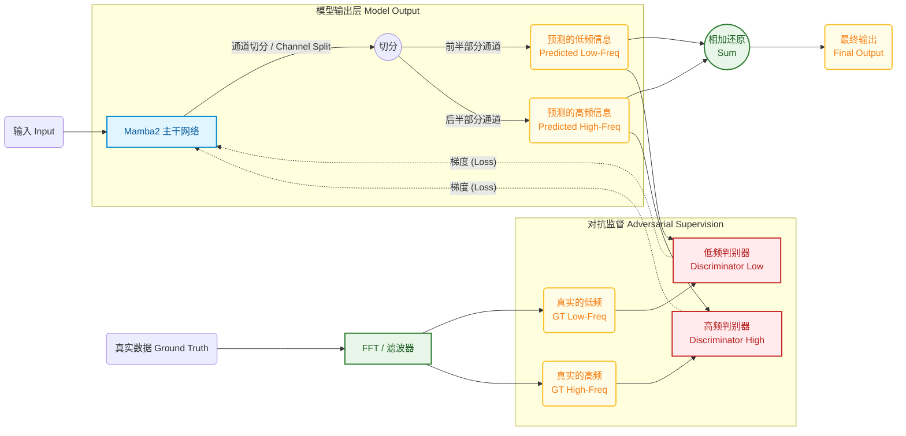
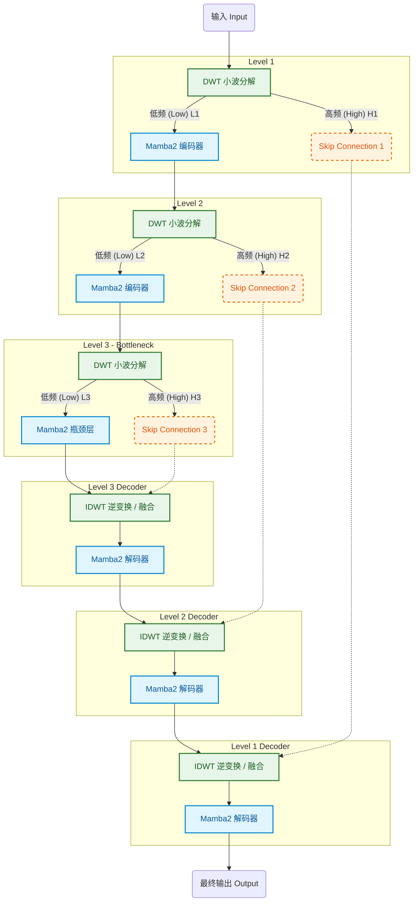

- 你想用 **卷积 / Mamba** 等可学习核直接处理序列
    
- 输出的是特征或者序列，但**这些特征是可学习的，没有明确低频和高频标记**
    
- 所以你不知道怎么去分离低频和高频做多尺度对抗或约束
    

这确实是深度网络处理序列时的常见问题：**卷积或 Mamba 学到的表示是混合频谱的**，没有直接对应传统小波的“低频/高频”。

---

## 1️⃣ 为什么直接输出无法分辨高低频

1. 可学习核（卷积/Mamba）会自动组合不同频率成新的特征：
    
    - 核可能同时响应低频和高频
        
    - 输出维度只是通道或状态，没有频率标签
        
2. 传统小波/子带的“低频”和“高频”是**固定滤波 + 下采样**产生的
    
    - 可学习核输出是混合表示，不保证正好有单一频带特征
        
3. 所以如果你想在特征上做“低频/高频对抗”，**必须先显式分离**，否则网络的每个通道都可能是混合频率
    

---

## 2️⃣ 解决方法

### 方法 A：先做固定小波/滤波分解，然后送入卷积/Mamba

- 优点：低频/高频明确，容易约束
    
- 缺点：失去部分可学习表示自由度
    

流程：

1. 输入序列 → DWT 或 FIR 低通+高通 → 得到 (A_1, D_1)
    
2. 每个子带输入卷积/Mamba → 提取特征
    
3. 可加对抗 loss / 约束在每个子带
    

---

### 方法 B：用可学习卷积/Mamba 自己学习低高频，但辅助频率约束

- 保留可学习核自由度，同时尽量让不同通道捕捉不同频带：
    

1. 给网络输出添加 **频率分布约束**：
    
    - 对输出特征做傅里叶变换 → 得到频谱
        
    - 可以强制某些通道主要覆盖低频，某些通道主要覆盖高频
        
    - 损失示例：  
     $$   [  
        L_\text{freq} = \sum_{c \in \text{low}} | \hat{f}_c(\text{high freq}) |^2
        
        - \sum_{c \in \text{high}} | \hat{f}_c(\text{low freq}) |^2  
            ]$$
            
2. 或者用 **多尺度卷积核**（大核捕低频，小核捕高频）作为引导
    

- 优点：保持网络学习自由度，同时可以在训练中引导“低频/高频分化”
    
- 缺点：训练稍复杂，需要频谱计算或核设计
    

---

### 方法 C：直接对整个输出做多尺度对抗（不明确低高频）

- 忽略“哪个通道是低频高频”，在整个特征上做多尺度判别器：
    
    - 判别器可以同时看全局（低频效果）和局部（高频细节）
        
    - 网络自己会学出不同通道对应不同频率特征
        
- 优点：最简单，不需要明确分频
    
- 缺点：你无法显式控制低频/高频特征，但对抗训练可能会自然形成多尺度表示
    

---

## 3️⃣ 实践建议

- 如果你想**明确低频/高频约束** → 先用传统小波或固定滤波分解，再送网络
    
- 如果你想**保留可学习自由度** → 可以用频率约束或多尺度卷积核引导通道
    
- 如果只是做对抗 / 模仿训练 → 可以对全特征多尺度做判别器，不必明确分低高频
    

> 换句话说，卷积/Mamba 输出本身没法直接标记低高频，需要**额外机制**去约束或引导。

---

我可以帮你画一个**可学习核 + 频率引导或判别器多尺度对抗**的示意图，直观展示如何训练而不需要固定分频。

你希望我画吗？







```mermaid

```
